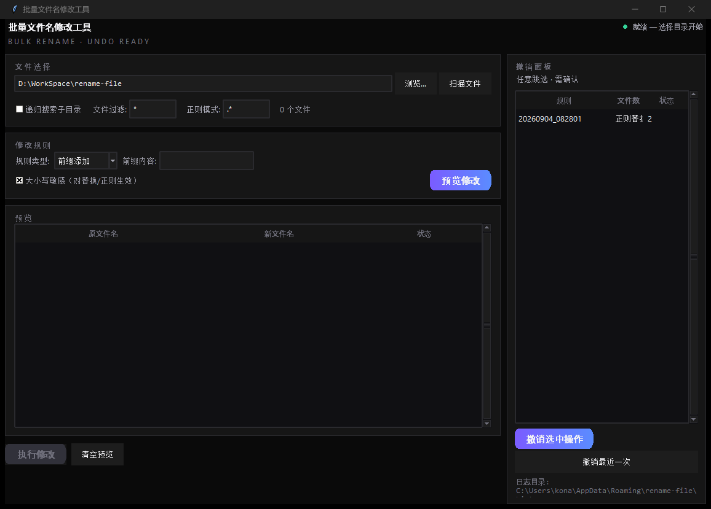

# rename-file · 批量文件名修改工具

Windows 桌面批量重命名工具：四类规则 + **可撤销**的操作日志 + CLI 自动化。
tkinter 标准库实现，零第三方运行时依赖。



## 功能

| 功能 | 说明 |
|------|------|
| 四类重命名规则 | 前缀添加 / 后缀添加 / 字符串替换 / 正则替换（支持忽略大小写） |
| **撤销** | 每次执行写操作日志，可逐步回退；支持**任意跳选**撤销历史中任一操作 |
| 嵌套撤销 | 保留最近 10 次操作，已撤销的日志归档保留、可追溯 |
| 冲突安全 | 还原名被占用时跳过留痕，**绝不覆盖**；冲突/无效文件在预览阶段拦截 |
| 大小写改名 | `readme.txt → Readme.txt` 自动走两步法（临时名中转），执行/撤销双向 |
| 双入口 | GUI（tkinter）与 CLI（`rename-cli`）共用同一 core，行为完全一致 |
| 失败留痕 | 单条失败（文件被占用等）不中断整批，明细写回日志 |

## 使用

### GUI

```bash
python main.py        # 或打包后双击 main.exe
```

1. 选择目标目录 → 扫描文件
2. 设置规则 → 预览修改（检查状态列）
3. 执行修改（操作会记录撤销日志，可回退）
4. 右侧撤销面板：选中任一操作 → 撤销（弹还原预览，确认后执行）

### CLI

```bash
# 预览（不修改文件、不写日志）
rename-cli --dry-run --dir D:/photos --filter "*.jpg" --rule regex "^IMG_" "2023_"

# 执行（写撤销日志）
rename-cli --apply --dir D:/photos --rule regex "^IMG_" "2023_"

# 撤销最近一次 / 查看可撤销栈
rename-cli --undo
rename-cli --undo --list
```

规则类型：`prefix` / `suffix` 后接 1 个文本参数；`replace` / `regex` 后接
`查找 替换为` 两个参数；也接受中文标签（`--rule 正则替换 ...`）。
退出码：`0` 成功 · `1` 运行失败（含部分失败、撤销不成立）· `2` 参数错误。

### 下载 exe

打 tag（如 `v1.0.0`）后 CI 自动构建并发布 Release，从
[Releases](https://github.com/lggyx/rename-file/releases) 下载
`rename-file-<tag>.zip`，解压后运行 `main.exe`（或 `install.bat` 安装）。

## 架构

```
rename_file/
├── core/     业务层（GUI/CLI 共用，pytest 覆盖）
│   ├── rules     规则引擎          ├── history   撤销日志存储（%APPDATA%）
│   ├── validate  合法性/冲突检查    ├── engine    预览与执行（日志先行、两步法）
│   ├── scanner   文件扫描          └── undo      撤销引擎（任意跳选、0 还原不成立）
├── gui.py    tkinter 界面
└── cli.py    argparse 命令行
```

设计文档：`design/flowcharts.md`（模块架构 / 业务流程 / 撤销状态机 / 边界清单）、
`design/prototype.html`（交互原型，重构流程的第①步产物）。

关键设计决策（已验证）：

- **日志先行**：撤销日志写入失败 → 中止执行且不改动任何文件
- **两步法**：仅大小写变化的改名经由临时名中转，中途失败自动回滚
- **0 条还原 → 撤销不成立**：操作保持可撤销，避免文件卡在中间状态无法找回
- 文件名比较一律忽略大小写（Windows 语义）

## 开发

```bash
uv sync                     # 安装依赖（含 dev 组：pytest / ruff）
uv run pytest tests -q      # 测试
uv run ruff check rename_file tests main.py build.py
python build.py             # PyInstaller 打包 + 分发包（distribution/）
```

## 分支与工作流

重构遵循「原型验证 → 流程建模 → 实现」三步走：
`design/**`（原型与流程图，确认后合入 main）→ `refactor/**`（按里程碑实现）→ main。
CI：push 运行 ruff + pytest（Windows runner）；打 tag 自动构建 exe 并发布 Release。

## 许可证

MIT
