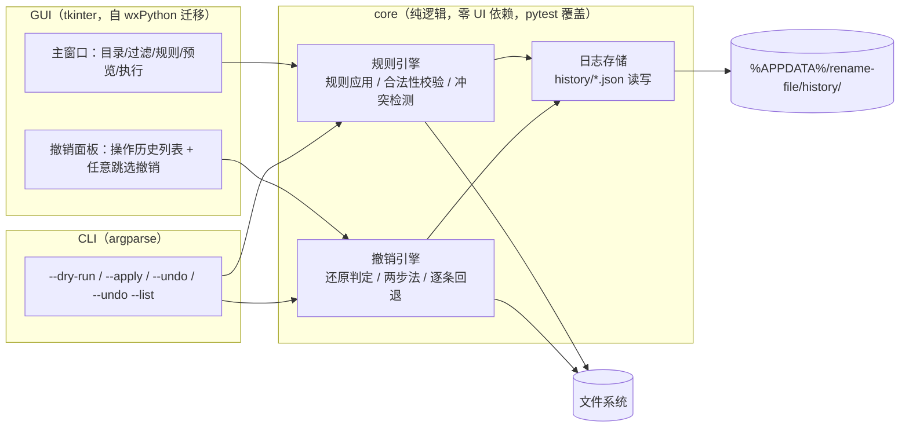
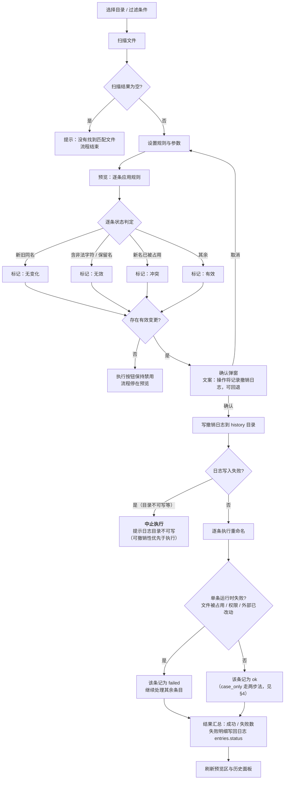
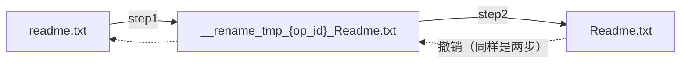
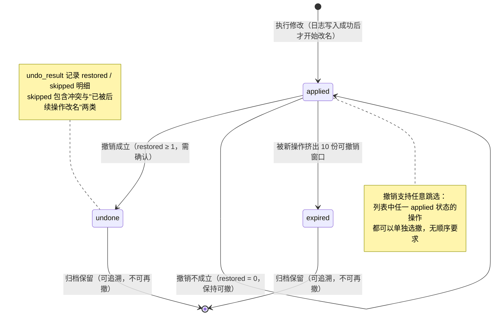

# rename-file 重构 · 流程建模（三步走第②步）

> 分支：`design/rename-file-flow`。第①步原型（`design/prototype.html`）已验证并通过，以下决策已拍板（2026-09-04）：
>
> | # | 决策点 | 结论 |
> |---|--------|------|
> | 1 | GUI 框架 | **迁移 tkinter**（现有代码实为 wxPython，按子 Prompt #19 重写 GUI 层） |
> | 2 | 撤销确认 | **必须先弹还原预览，确认后执行** |
> | 3 | 已撤销日志 | **归档保留、可追溯**；可撤销窗口 = 最近 10 份 |
> | 4 | 撤销顺序 | **支持任意跳选**（不要求按栈顺序，见 §4 的纠缠规则） |
> | 5 | 日志目录 | **`%APPDATA%/rename-file/history/`**（跨工作目录） |
>
> 按 README 边界规则：异常分支、空状态、失败态全部显式画出。

## 1. 模块架构

GUI 与 CLI 共用同一个 core（撤销引擎、规则引擎、日志存储），业务逻辑零重复——这是子 Prompt #19 任务 B 的核心约束。



## 2. 主业务流程（含全部异常分支）



## 3. 撤销执行流程（任意跳选 + 确认）

```mermaid
flowchart TD
    U0["用户在历史列表选定任一「可撤销」操作<br/>（或点「撤销最近一次」）"] --> U1[弹还原预览：逐条还原判定]
    U1 --> U2{逐条判定 undoEntryState}
    U2 -- "case_only：当前名存在（忽略大小写比较）" --> U3[可还原 · 两步法]
    U2 -- "非 case_only：e.to 已不存在" --> U4[跳过：已被后续操作改名或删除]
    U2 -- "非 case_only：e.from 名被占用" --> U5[跳过：还原名冲突，绝不覆盖]
    U2 -- 其余 --> U6[可还原]
    U3 & U4 & U5 & U6 --> V{用户确认?}
    V -- 取消 --> Z1[关闭弹窗，什么都不改]
    V -- 确认 --> W[倒序执行可还原条目]
    W --> W1{case_only?}
    W1 -- 是 --> W2["两步法：to → 临时名 → from<br/>临时名 = __rename_tmp_{op_id}_{from}"]
    W1 -- 否 --> W3[to → from]
    W2 & W3 --> X{单条运行时失败?}
    X -- 是 --> X1[记入 skipped，继续]
    X -- 否 --> X2[restored +1]
    X1 & X2 --> Y0{restored = 0 ?}
    Y0 -- "是（全部被跳过）" --> Y1["<b>撤销不成立</b><br/>操作保持「可撤销」<br/>提示：先撤销占用了其输出文件的后续操作"]
    Y0 -- 否 --> Y2[写回 undo_result {restored, skipped}<br/>op.undone = true · 归档保留]
```

> **0 条还原 → 撤销不成立**是原型阶段验证出的关键规则（详见 §6 场景 C）：否则操作被标记已撤销但文件卡在中间状态，原名将永远无法通过撤销找回。

## 4. Windows 大小写改名两步法

执行与撤销**双向**都走两步。`readme.txt → Readme.txt` 直接 rename 在大小写不敏感文件系统上会失败。



- 日志中该条目标记 `case_only: true`、`via_tmp: "__rename_tmp_…"`。
- step1 与 step2 之间若程序崩溃，会残留 `__rename_tmp_*` 文件 → **GUI/CLI 启动时扫描目标目录**，发现残留临时名文件时提示用户可安全删除（见 §7 边界 8）。
- 冲突检查必须用「忽略大小写」语义：`Readme.txt` 与 `readme.txt` 视为同名。

## 5. 操作日志状态机



## 6. 任意跳选的纠缠规则（原型实测场景）

| 场景 | 操作序列 | 结果 |
|------|----------|------|
| A. 正常逆序撤销 | Op1: notes→memo；Op2: memo→archived；撤 Op2 再撤 Op1 | 文件回到 notes.txt ✅ |
| B. 跳选撤销较早操作 | 直接撤 Op1（其输出 memo.txt 已被 Op2 改名） | **撤销不成立**，Op1 保持可撤，提示先撤 Op2 ✅ |
| C. 若无 §3 的"0 还原不成立"规则 | 直接撤 Op1 且被标记已撤销 | 文件卡在 archived，notes.txt 永远无法撤销找回 ❌（已在原型中排除） |
| D. 大小写改名撤销 | readme→Readme 后撤销 | 正常还原，两步法双向生效 ✅ |

## 7. 边界与失败态清单（实现时逐条对应测试用例）

1. **Windows 非法字符** `<>:"/\|?*` 与保留名（CON/COM1…）→ 预览阶段标「无效」。
2. **大小写不敏感冲突检查**：预览、执行、撤销三处都必须按忽略大小写比较文件名。
3. **大小写改名两步法**：执行、撤销双向（§4）。
4. **临时名残留**：`__rename_tmp_*` 崩溃残留 → 启动时扫描提示。
5. **日志目录不可写** → 中止执行（可撤销性优先）。
6. **文件被占用 / PermissionError** → 单条 failed/skipped 留痕，不中断整批。
7. **目标目录被外部改动**（扫描结果过期）→ 执行/撤销时逐条重新校验，失败条目留痕。
8. **日志格式版本**：`version` 字段，未来格式迁移兼容。
9. **空状态**：扫描为空、预览无有效变更、历史为空时撤销按钮禁用。

## 8. 里程碑映射（对应子 Prompt #19 任务，供第③步拆分）

| 里程碑 | 内容 | 验证标准 |
|--------|------|----------|
| M1 | core：规则引擎 + 日志存储 + 撤销引擎（含 §7 全部边界） | pytest 全绿（tmp_path 沙箱） |
| M2 | GUI 迁移 tkinter + 撤销面板（任意跳选 + 确认预览） | 运行时真实走查原型全部场景 |
| M3 | CLI（--dry-run/--apply/--undo/--undo --list） | CLI 与 GUI 走同一 core，行为一致 |
| M4 | 工程化：ruff + CI + PyInstaller exe Release + README 重写 | tag 构建产物冒烟启动通过 |
